# Welcome to Oracle Cloud Native Environment Training 

---
This site contains videos to facilitate your usage of the technologies, software and tools used by Oracle to develop microservices-based applications that can be deployed in environments that support open standards and specifications.

On these pages you will find material such as videos, documents and useful resource links covering areas including the following:
- Container Runtime
- Orchestration and Deployment
- Microservices Traffic Management
- Management Operations
- Monitoring

Information and videos presented here cover Microservices technologies which are components of the Oracle Cloud Native Environment General Availability announcement, as well as additional technologies to help you expand your learning of microservices.

### Environment Installation Videos
The following videos will introduce you to the installation procedure and scaling of the Oracle Cloud Native Environment.

#### Release 1.4 and 1.5

#### Release 1.3

#### Release 1.2

[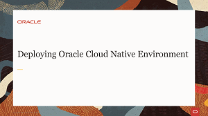](https://youtu.be/M1WyPPxEM1U)
[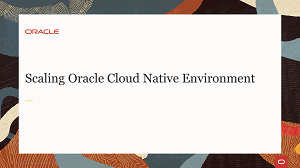](https://youtu.be/AmAOBb-dk-4)

### Kubernetes Videos
An open-source system for automating the deployment, scaling and management of containerized applications, Kubernetes provides the tools to build a cluster of systems to support the launching of containerized applications. These containers can be deployed across the cluster systems and scaled as needed.

The following videos will introduce you to the Kubernetes cluster technology and its components. They show how a Kubernetes cluster is built, and how container applications in pods are deployed on the cluster nodes.

[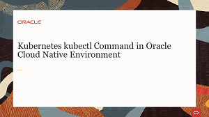](https://youtu.be/0pa4rlFbFdk)
[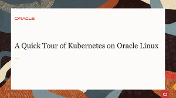](https://youtu.be/syBe1H-qe8U)
[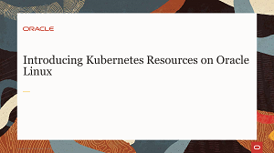](https://youtu.be/e5m3TlvM4y4)

### Kata Container Videos
Kata Container software delivers the framework for creating lightweight virtual machines (VMs) that easily plug into container ecosystems. Kata Containers offer similar virtual machine levels of security while maintaining the efficiencies gained from the deployment of traditional containers.

The following videos will introduce you to Kata Containers functionality and demonstrate how Kata Containers are deployed in your Kubernetes cluster.

[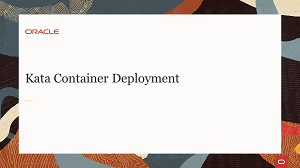](https://youtu.be/iUbs38MKcdI)

### Container Videos
Podman provides a way to build, share and run containers conforming to the the Open Containers Initiative (OCI) format.

The following videos will introduce you to Containers, and demonstrate using Podman to deploy and manage container images designed for Kubernetes, Oracle Container Runtime for Docker, and Oracle Linux Cloud Native Environment.

[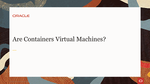](https://youtu.be/AvNDTpmHOMk)

[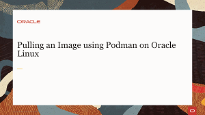](https://youtu.be/QmZE-lFNzk4)
[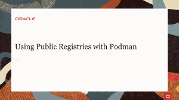](https://youtu.be/q57hNilpakk)

[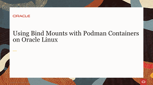](https://youtu.be/Kw5vdNRRaZc)
[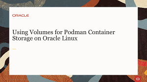](https://youtu.be/qIjTMOfGa_Y)

### Oracle Cloud Native Environment Hands On Labs

#### [Return to main page](../README.md)
