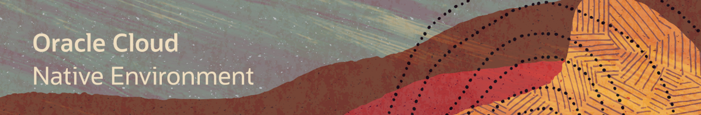

# Welcome to Oracle Cloud Native Environment Training 

---
This site contains videos to facilitate your usage of the technologies, software and tools used by Oracle to develop microservices-based applications that can be deployed in environments that support open standards and specifications.

On these pages you will find material such as videos, documents and useful resource links covering areas including the following:
- Container Runtime
- Orchestration and Deployment
- Microservices Traffic Management
- Management Operations
- Monitoring

Information and videos presented here cover Microservices technologies which are components of the Oracle Cloud Native Environment General Availability announcement, as well as additional technologies to help you expand your learning of microservices.

### Environment Installation Videos
The following videos will introduce you to the installation procedure and scaling of the Oracle Cloud Native Environment.

#### Release 1.4 and 1.5

### Oracle Cloud Native Environment Hands On Labs

#### [Return to main page](../README.md)
