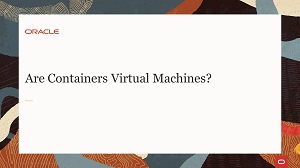

# Welcome to the Oracle Linux Track

---
This site is the place to explore Oracle Linux to help you grow your skillset using free videos and hands-on tutorials and labs. Whether you are working with traditional, cloud-based, or virtual environments, these skills will progress your knowledge into becoming a better Oracle Linux End-user, DevOps, or System Administrator.

On these pages, you will find videos, documents and other useful resources on topics such as: Installing the Operating System, Technologies and components included in the Oracle Linux operating environment, Building systems to suit your needs, whether development or production, physical or virtual, Applying resources using fully-featured enterprise software

- [Installation and Boot Process](./inst_boot/inst_boot.md): This track focuses on the installation and boot process. Take this track to learn how to complete an Oracle Linux installation for on-premises deployment and how to create an Oracle Linux instance on Oracle Cloud Infrastructure. You can also learn about the boot process and how to configure different services to start at boot time.
- [Administration](./admin/admin.md): This track focuses on common administration tasks that you can perform on Oracle Linux. Take this track to learn how to configure the system date and time, automate tasks, dynamically load and unload kernel modules, configure users and groups, and explore the proc and sysfs file systems to view and configure system hardware and system processes.
- [Monitoring and Logging](./mon_log/mon_log.md): This track focuses on typical monitoring and logging tasks performed on a Linux system. Take this track to learn how to monitor system performance and review system logs on Oracle Linux.
- [Networking](./network/network.md): This track focuses on the configuration files, firewalls, and command line utilities to get a Linux system online. Take this track to learn how to connect Oracle Linux to the network. Being able to configure networks is an essential skill to access programs, storage and data on remote systems.
- [Package Management](./pkg_mgmt/pkg_mgmt.md): This track focuses on software package management, an essential skill needed to keep your Oracle Linux system up to date with the latest software enhancements, bug fixes, and security patches. Oracle Linux 8 introduced DNF, which replaces YUM, and in this track, we cover how to use DNF, install the Oracle UEK kernel and how to add repositories.
- [Oracle Ksplice](./ksplice/ksplice.md): In this track you will learn to install, configure and use Oracle Ksplice to provide rebootless kernel and critical user-space updates. Oracle Ksplice allows you to install the latest kernel and key user-space security and bug fix updates while the system is running.
- [Remote Management](./rem_mgmt/rem_mgmt.md): In this track you will learn how to establish secure connections to remote Oracle Linux systems. With secure connections, all traffic transmitted over the wire is encrypted and protected from password sniffing attacks and other outside monitoring.
- [Storage Management](./stor_mgmt/stor_mgmt.md): In this track you will get started on using fdisk, formatting, filesystems, and disk encryption. Whether manually partitioning your primary disk, adding additional disks for storage, or creating shared storage, working with disks is a skill all Linux Administrators should know.
- [Virtualization](./stor_mgmt/stor_mgmt.md): This track contains lessons on KVM, VirtualBox, Containers and Kubernetes. It covers lessons on installation, management, creation and other aspects related to using virtualization on Oracle Linux. Learn to take advantage of Linux virtualization and run operating systems as guests within Oracle Linux.
- 
- [Oracle Linux](./OL/ol.md): Develop Linux skills you can use anywhere; in Oracle Cloud Infrastructure, on premise, or on other public clouds. Become savvy on an operating system that is free to use, free to distribute, free to update and easy to download so you can get started today.

## Virtualization
Take advantage of Linux virtualization and run operating systems as guests within Oracle Linux. In these videos we cover lessons on installation, management, creation and other aspects related to using virtualization on Oracle Linux.

### KVM Management Videos

### VirtualBox Videos

### Container Videos

### Kubernetes Videos

### Virtualization Hands On Lab

### Virtualization Tutorial

#### [Return to main page](../README.md)
