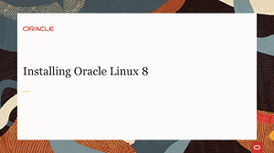
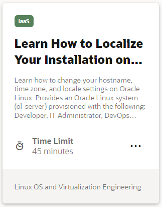
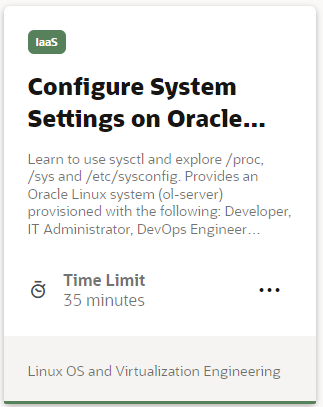
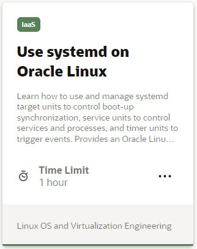
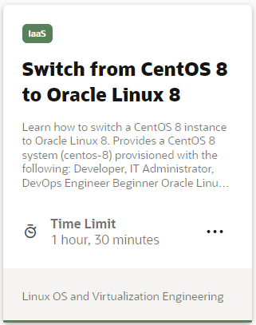
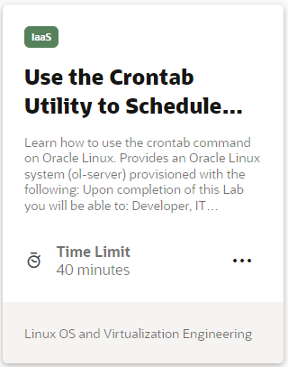
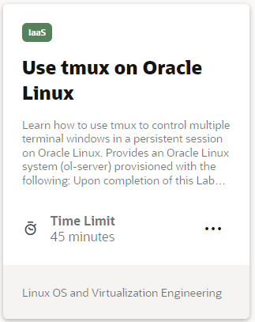
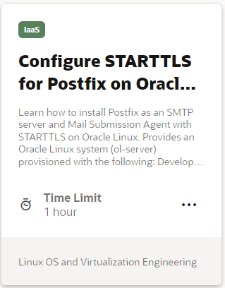
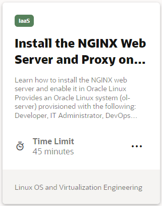
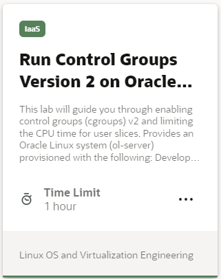

# Welcome to Oracle Linux Training

---
This site is the place to explore Oracle Linux to help you grow your skillset using free videos and hands-on tutorials and labs. Whether you are working with traditional, cloud-based, or virtual environments, these skills will progress your knowledge into becoming a better Oracle Linux End-user, DevOps, or System Administrator.

On these pages, you will find videos, documents and other useful resources on topics such as:

- Installing the Operating System
- Technologies and components included in the Oracle Linux operating environment
- Building systems to suit your needs, whether development or production, physical or virtual
- Applying resources using fully-featured enterprise software

## Installation
One of the first skills to learn is how to install Oracle Linux.

### Installation Videos
These videos focus on the installation and boot process. You can learn step-by-step how to complete an Oracle Linux 8 installation for on-premises deployment and how to create an Oracle Linux 8 instance on Oracle Cloud Infrastructure. You can also learn about the boot process and how to configure different services to start at boot time.

### Installation Hands On Labs
Each hands-on lab provides step-by-step procedures to complete specific tasks in an Oracle-provided free lab environment. Follow the procedures to connect to your Oracle Linux compute instance on Oracle Cloud Infrastructure and complete the labs. Alternatively, you can perform the lab steps on your own Oracle Linux environment.

## Administration
Learn how to administer Oracle Linux. These tasks are applicable for on-premises systems or Oracle Cloud Infrastructure instances.

### Administration Videos
These short videos go through some common administration tasks that you can perform on Oracle Linux. You can learn step-by-step how to configure the system date and time, automate tasks, dynamically load and unload kernel modules, configure users and groups, configure networking, and explore the proc and sysfs file systems to view and configure system hardware and system processes.

### Administration Hands On Labs
Each hands-on lab provides step-by-step procedures to complete specific tasks in an Oracle-provided free lab environment. Follow the procedures to connect to your Oracle Linux compute instance on Oracle Cloud Infrastructure and complete the labs. Alternatively, you can perform the lab steps on your own Oracle Linux environment.

## Monitoring and Logging
Learn how to monitor system performance and review system logs on Oracle Linux.

### Monitoring and Logging Videos
These videos go through typical monitoring and logging tasks performed on a Linux system.

### Monitoring and Logging Hands On Labs
Each hands-on lab provides step-by-step procedures to complete specific tasks in an Oracle-provided free lab environment. Follow the procedures to connect to your Oracle Linux compute instance on Oracle Cloud Infrastructure and complete the labs. Alternatively, you can perform the lab steps on your own Oracle Linux environment.

## Networking
Learn how to connect Oracle Linux to the network.

### Networking Videos
These videos go through the configuration files, firewalls, and command line utilities to get a Linux system online.

### Networking Hands On Labs
Each hands-on lab provides step-by-step procedures to complete specific tasks in an Oracle-provided free lab environment. Follow the procedures to connect to your Oracle Linux compute instance on Oracle Cloud Infrastructure and complete the labs. Alternatively, you can perform the lab steps on your own Oracle Linux environment.

#### [Return to main page](../README.md)
