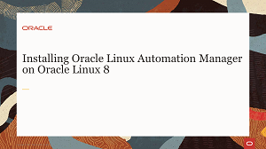
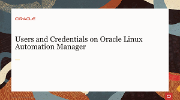
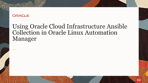

# Welcome to Oracle Linux Automation Manager Training

---
This site provides free training to help introduce you to Oracle Linux Automation Manager and improve your skills with its automation tools.

The Oracle Linux Automation Engine is an automation tool for deploying software, configuring systems, and orchestrating tasks such as upgrades and updates, in the form of playbooks.

Oracle Linux Automation Manager provides features that allow your organization to effectively manage infrastructure configuration through a browser user interface. Using Oracle Linux Automation Manager you can:
- Create and configure permissions for organizations, users, and teams that use Oracle Linux Automation Manager 
- Create projects that import Oracle Linux Automation Engine playbooks from various sources, such as a local machine or from a remote git repository
- Create an inventory which specifies the hosts where playbook tasks run
- Create job templates that specify the projects and playbooks to run
- Manually launch or schedule the launch of job templates

### Installing Oracle Linux Automation Manager Videos
These videos will get you started with the installation and overview of Oracle Linux Automation Manager.

### Administrating Oracle Linux Automation Manager Videos
Learn how to add users, organizations, credentials, and permissions to prepare for running jobs.

### Oracle Linux Automation Manager Hands On Labs

#### [Return to main page](../README.md)
