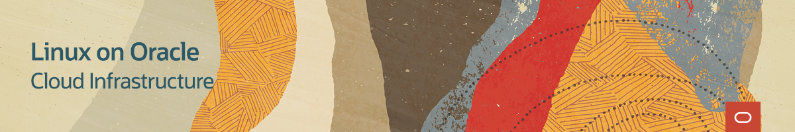
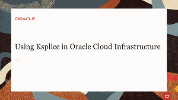
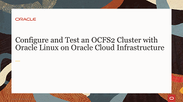
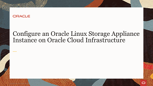

# Welcome to Linux on Oracle Cloud Infrastructure Training

---
This site provides an elearning path with step-by-step instructions and guidance for using Linux on Oracle Cloud Infrastructure.

As a Linux administrator, we walk you through building your first components on the Oracle Cloud Infrastructure and help you acquire deeper knowledge about Linux and Cloud deployment.

Get started today and see how your Linux administration helps achieve the benefits Linux brings to running your services and applications on Oracle Cloud Infrastructure.

### Deploying Cloud Components with the Web Console Videos
Learn to provision and launch compute instances with the cloud web console to support your cloud solution in Oracle Cloud infrastructure.

### Deploying Cloud Components Tutorial

### Administering Instances In Oracle Cloud Infrastructure Videos
Learn to administer compute instances using a range of tools and solutions provided to support your cloud solution in Oracle Cloud infrastructure.

### Managing Security and Access to your Cloud Videos
Learn to secure access to instances and manage traffic between virtual networks in Oracle Cloud Infrastructure.

### Networking your Oracle Cloud Infrastructure
Learn to build and administer virtual networks and gateways in Oracle Cloud Infrastructure. Manage instance networking and interfaces.

### Using Storage on Oracle Cloud Infrastructure
Learn to discover and administer block volume storage and create shared cluster storage for instances.

#### [Return to main page](../README.md)
