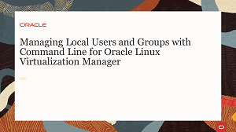
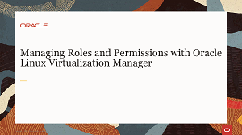
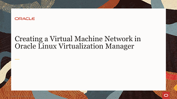
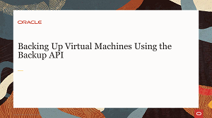
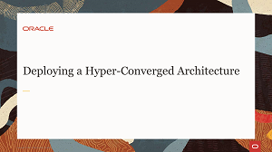
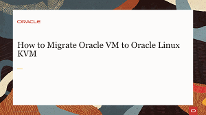

# Welcome to Oracle Linux Virtualization Manager Training

---
This site contains videos to facilitate your usage of the technologies and tools used by Oracle Linux Virtualization Manager. Oracle Linux Virtualization Manager is an open-source distributed server virtualization solution, easily deployed to configure, monitor, and manage an Oracle Linux Kernel-based Virtual Machine (KVM) environment with enterprise-grade performance and support from Oracle.

On these pages you will find material such as videos, documents and useful resource links covering areas including the following:
- Implementing and administering the system as a large scale, centralized management for server virtualization.
- Building infrastructure and adding Virtual Machines and resources using fully featured software targeted to enterprise systems and deployments.

Information and videos presented here cover technologies and components to help you expand your learning of the Oracle Linux Virtualization Manager system.

### Administration and Deployment Videos
The following content will introduce you to the administration of the Oracle Linux Virtualization Manager environment as well as the deployment of hosts and architectural resources.

### Oracle Linux Virtualization Manager Videos

#### [Return to main page](../README.md)
