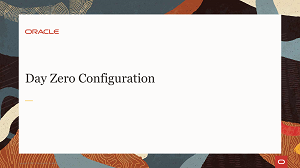
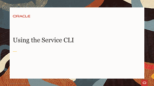
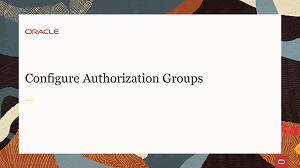
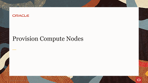
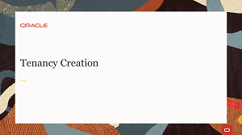
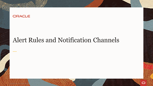

# Welcome to Oracle Private Cloud Appliance Training

---
This site contains videos to facilitate your learning of the administrative and user tasks performed with the technologies and tools of the Oracle Private Cloud Appliance.

On these pages you will find material such as videos, documents and useful resource links covering areas including the following:
- Tasks performed from the Service Enclave.
- Tasks performed from the Compute Enclave.

Information and videos presented here cover technologies and components to help you expand your learning of the Oracle Private Cloud Appliance.

## Service Enclave Tasks
The Oracle Private Cloud Appliance runs its own specific and separate administration area known as the Service Enclave. The Service Enclave is the part of the system where the appliance infrastructure is controlled. Access is closely monitored and restricted to privileged administrators. Functionality provided by the Service Enclave includes hardware and capacity management, tenancy management, system and component upgrade, system backup and restore, monitoring and tools for service and support, and so on.

To access the Service Enclave, you use either the Service Web UI or Service CLI.

### Service Enclave Tasks Videos
This section provides video training for Day 0 configuration and for administrator tasks performed from the Service Enclave.

### Oracle Private Cloud Appliance Videos

#### [Return to main page](../README.md)
