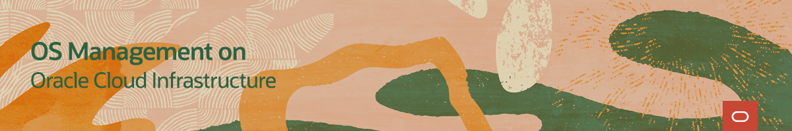

# Welcome to OS Management on Oracle Cloud Infrastructure Training

---
The Oracle Cloud Infrastructure OS Management service allows you to manage updates and patches for the operating system environment on your Oracle Cloud Infrastructure instances.

On these pages, you will find videos, documents, and other useful resources on topics such as:
- Getting Started with OS Management
- Installing and Patching a Windows instance
- Checking the status of the Oracle Cloud Agent

### OS Management on Oracle Cloud Infrastructure Videos

### OS Management on Oracle Cloud Infrastructure Hands On Labs

#### [Return to main page](../README.md)
