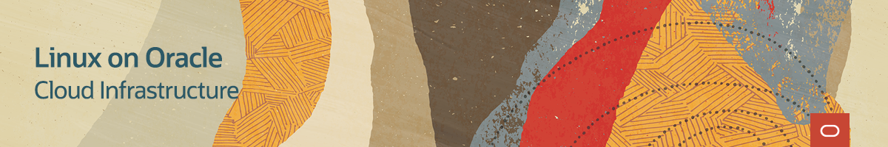
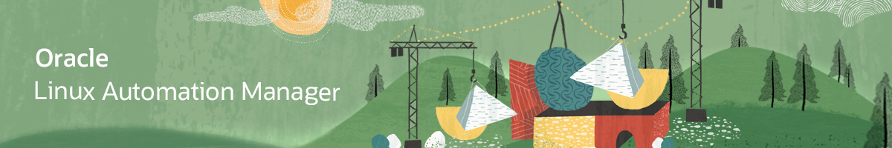
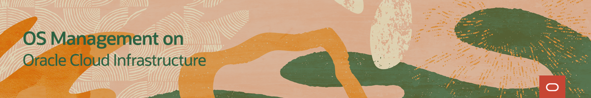

# Welcome to Oracle Linux Learning Library 

---
This Learning Library provides you with immediate learning opportunities including learning paths of short video demonstrations for:
- [Introduction to Oracle Linux](./intro/intro.md): Provides an introduction to Oracle Linux for new developers, students or business people with minimal or no previous knowledge of Oracle Linux.

- [Oracle Linux](./OL/ol.md): Develop Linux skills you can use anywhere; in Oracle Cloud Infrastructure, on premise, or on other public clouds. Become savvy on an operating system that is free to use, free to distribute, free to update and easy to download so you can get started today.

- [Linux on Oracle Cloud Infrastructure](./OLOCI/oloci.md): See how to use Linux to deliver powerful compute and networking performance with a comprehensive portfolio of infrastructure and platform cloud services.

- [Oracle Cloud Native Environment](./OCNE/ocne.md): Learn how you can deploy the software and tools to develop microservices-based applications in-line with open standards and specifications.

- [Oracle Linux Automation Manager](#olam): Learn how to use Oracle Linux Automation Engine as an automation tool for deploying software, configuring systems, and orchestrating tasks such as upgrades and updates, in the form of playbooks.

- [Oracle Linux How-To Video Series](#howt): Discover how to grow your diagnostic and troubleshooting skillset using Oracle Linux and interact with Oracle support for issue resolution.

- [Oracle Linux Virtualization Manager](#olvm): Use resources available to adopt this open-source distributed server virtualization solution. Gain proficiency in deploying, configuring, monitoring, and managing an Oracle Linux Kernel-based Virtual Machine (KVM) environment with enterprise-grade performance.

- [OS Management on Oracle Cloud Infrastructure](#osms): Learn how to use the OS Management service to manage updates and patches for your operating system environments on your Oracle Cloud Infrastructure instances.

- [Oracle Private Cloud Appliance](#opca): Learn to perform various user and administrative tasks from the Compute Enclave and from the Service Enclave.

# Welcome to Oracle Linux Automation Manager Training 

---
This site provides free training to help introduce you to Oracle Linux Automation Manager and improve your skills with its automation tools.

The Oracle Linux Automation Engine is an automation tool for deploying software, configuring systems, and orchestrating tasks such as upgrades and updates, in the form of playbooks.

Oracle Linux Automation Manager provides features that allow your organization to effectively manage infrastructure configuration through a browser user interface. Using Oracle Linux Automation Manager you can:
- Create and configure permissions for organizations, users, and teams that use Oracle Linux Automation Manager 
- Create projects that import Oracle Linux Automation Engine playbooks from various sources, such as a local machine or from a remote git repository
- Create an inventory which specifies the hosts where playbook tasks run
- Create job templates that specify the projects and playbooks to run
- Manually launch or schedule the launch of job templates

### Oracle Linux Automation Manager Videos

### Oracle Linux Automation Manager Hands On Labs

#### [Return to top](#top)

# Welcome to Oracle Linux How-To Video Series 

---
This page provides you information to help you grow your diagnostic and troubleshooting skillset using Oracle Linux. Whether you are working with traditional, cloud-based, or virtual environments, these skills will progress your knowledge into becoming a better Oracle Linux End-user, DevOps, or System Administrator.

These videos are intended as quick references or short procedural sequences.

### Oracle Linux How-To Videos

#### [Return to top](#top)

# Welcome to Oracle Linux Virtualization Manager Training 

---
This site contains videos to facilitate your usage of the technologies and tools used by Oracle Linux Virtualization Manager. Oracle Linux Virtualization Manager is an open-source distributed server virtualization solution, easily deployed to configure, monitor, and manage an Oracle Linux Kernel-based Virtual Machine (KVM) environment with enterprise-grade performance and support from Oracle.

On these pages you will find material such as videos, documents and useful resource links covering areas including the following:
- Implementing and administering the system as a large scale, centralized management for server virtualization.
- Building infrastructure and adding Virtual Machines and resources using fully featured software targeted to enterprise systems and deployments.

Information and videos presented here cover technologies and components to help you expand your learning of the Oracle Linux Virtualization Manager system.

### Oracle Linux Virtualization Manager Videos

#### [Return to top](#top)

# Welcome to OS Management on Oracle Cloud Infrastructure Training 

---
The Oracle Cloud Infrastructure OS Management service allows you to manage updates and patches for the operating system environment on your Oracle Cloud Infrastructure instances.

On these pages, you will find videos, documents, and other useful resources on topics such as:
- Getting Started with OS Management
- Installing and Patching a Windows instance
- Checking the status of the Oracle Cloud Agent

### OS Management on Oracle Cloud Infrastructure Videos

### OS Management on Oracle Cloud Infrastructure Hands On Labs

#### [Return to top](#top)

# Welcome to Oracle Private Cloud Appliance Training 

---
This site contains videos to facilitate your learning of the administrative and user tasks performed with the technologies and tools of the Oracle Private Cloud Appliance.

On these pages you will find material such as videos, documents and useful resource links covering areas including the following:
- Tasks performed from the Service Enclave.
- Tasks performed from the Compute Enclave.

Information and videos presented here cover technologies and components to help you expand your learning of the Oracle Private Cloud Appliance.

### Oracle Private Cloud Appliance Videos

#### [Return to top](#top)

### Support or Contact

Having trouble with Pages? Check out our [documentation](https://docs.github.com/categories/github-pages-basics/) or [contact support](https://support.github.com/contact) and we’ll help you sort it out.
