---
# Welcome to Oracle Linux Learning Library
This Learning Library provides you with immediate learning opportunities including learning paths of short video demonstrations for:
- Introduction to Oracle Linux: Provides an introduction to Oracle Linux for new developers, students or business people with minimal or no previous knowledge of Oracle Linux.

- [Oracle Linux](#abcd): Develop Linux skills you can use anywhere; in Oracle Cloud Infrastructure, on premise, or on other public clouds. Become savvy on an operating system that is free to use, free to distribute, free to update and easy to download so you can get started today.
- Linux on Oracle Cloud Infrastructure: See how to use Linux to deliver powerful compute and networking performance with a comprehensive portfolio of infrastructure and platform cloud services.
- Oracle Cloud Native Environment: Learn how you can deploy the software and tools to develop microservices-based applications in-line with open standards and specifications.
- Oracle Linux Automation Manager: Learn how to use Oracle Linux Automation Engine as an automation tool for deploying software, configuring systems, and orchestrating tasks such as upgrades and updates, in the form of playbooks.
- Oracle Linux How-To Video Series: Discover how to grow your diagnostic and troubleshooting skillset using Oracle Linux and interact with Oracle support for issue resolution.
- Oracle Linux Virtualization Manager: Use resources available to adopt this open-source distributed server virtualization solution. Gain proficiency in deploying, configuring, monitoring, and managing an Oracle Linux Kernel-based Virtual Machine (KVM) environment with enterprise-grade performance.
- OS Management on Oracle Cloud Infrastructure: Learn how to use the OS Management service to manage updates and patches for your operating system environments on your Oracle Cloud Infrastructure instances.
- Oracle Private Cloud Appliance: Learn to perform various user and administrative tasks from the Compute Enclave and from the Service Enclave.


---
# Welcome to Oracle Linux Training <a name="abcd"></a>
This site is the place to explore Oracle Linux to help you grow your skillset using free videos and hands-on tutorials and labs. Whether you are working with traditional, cloud-based, or virtual environments, these skills will progress your knowledge into becoming a better Oracle Linux End-user, DevOps, or System Administrator.

On these pages, you will find videos, documents and other useful resources on topics such as:

- Installing the Operating System
- Technologies and components included in the Oracle Linux operating environment
- Building systems to suit your needs, whether development or production, physical or virtual
- Applying resources using fully-featured enterprise software

## Installation
One of the first skills to learn is how to install Oracle Linux.

### Installation Videos
These videos focus on the installation and boot process. You can learn step-by-step how to complete an Oracle Linux 8 installation for on-premises deployment and how to create an Oracle Linux 8 instance on Oracle Cloud Infrastructure. You can also learn about the boot process and how to configure different services to start at boot time.

[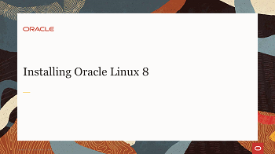](https://youtu.be/l6fapYCHaQ0)[](https://youtu.be/ETpaOwAcB7M)[](https://youtu.be/NP9BHTjih7g)[](https://youtu.be/0dv87RFGcKI)[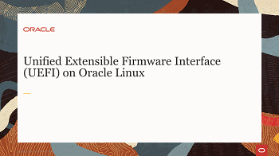](https://youtu.be/OVeso8h5HZA)[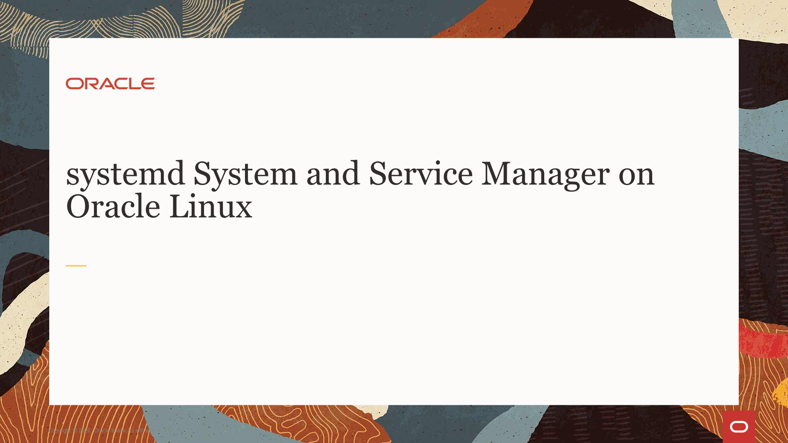](https://youtu.be/9uDvnZKhU8A)[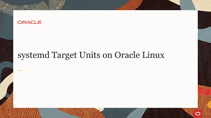](https://youtu.be/Tkxs-wfZrnw)

### Installation Hands On Labs
Each hands-on lab provides step-by-step procedures to complete specific tasks in an Oracle-provided free lab environment. Follow the procedures to connect to your Oracle Linux compute instance on Oracle Cloud Infrastructure and complete the labs. Alternatively, you can perform the lab steps on your own Oracle Linux environment.

[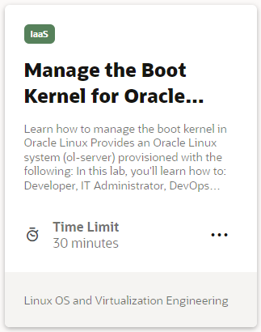](https://luna.oracle.com/lab/67f106f2-8c50-442c-b24f-108b806be84f)[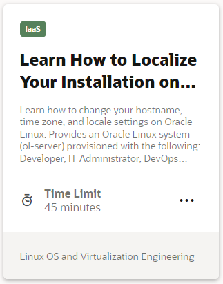](https://luna.oracle.com/lab/d657ae3c-ac29-4b0a-943e-e533f2e8093b)[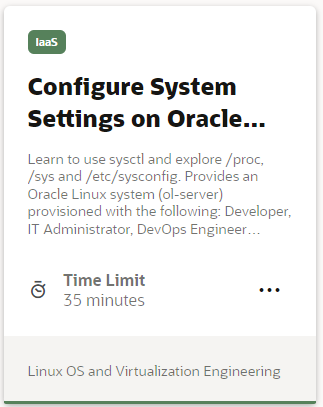](https://luna.oracle.com/lab/aa8f2377-7967-4e45-bf32-bdc8054d5c76)[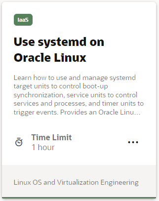](https://luna.oracle.com/lab/8a060473-bff3-4c04-9799-eb944951007c)[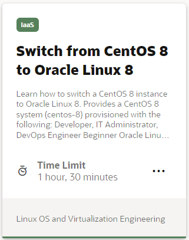](https://luna.oracle.com/lab/ee1c4ab9-010f-4b3c-bd1e-cdcca57800a2)

## Administration
Learn how to administer Oracle Linux. These tasks are applicable for on-premises systems or Oracle Cloud Infrastructure instances.

### Administration Videos
These short videos go through some common administration tasks that you can perform on Oracle Linux. You can learn step-by-step how to configure the system date and time, automate tasks, dynamically load and unload kernel modules, configure users and groups, configure networking, and explore the proc and sysfs file systems to view and configure system hardware and system processes.

[](https://youtu.be/q8VlYiF5sx8)[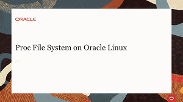](https://youtu.be/1F51ZHAVfAk)[](https://youtu.be/j9x2cuOE5_Y)[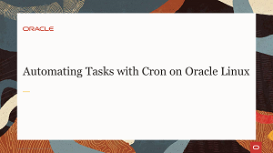](https://youtu.be/BpPGoRYTv9I)[](https://youtu.be/EIV3lpTeqXo)[](https://youtu.be/AeW42ZyzHrQ)[](https://youtu.be/fag6aHNUkdQ)[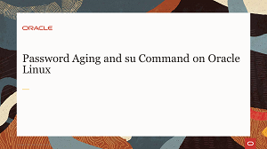](https://youtu.be/WrcnDpj3axQ)[](https://youtu.be/xpBBUPLEkZg)[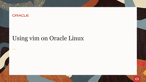](https://youtu.be/5xKldV3knzU)[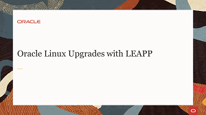](https://youtu.be/pk6tgzGpAU4)[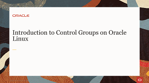](https://youtu.be/AiYK0VBW7e4)[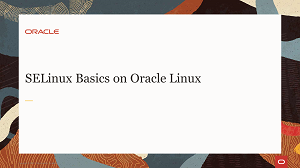](https://youtu.be/meKjLOxEu_o)

### Administration Hands On Labs
Each hands-on lab provides step-by-step procedures to complete specific tasks in an Oracle-provided free lab environment. Follow the procedures to connect to your Oracle Linux compute instance on Oracle Cloud Infrastructure and complete the labs. Alternatively, you can perform the lab steps on your own Oracle Linux environment.

[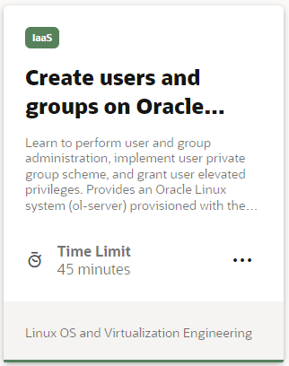](https://luna.oracle.com/lab/fb0e97c0-4522-422f-8be3-dd6f70a7b96e)[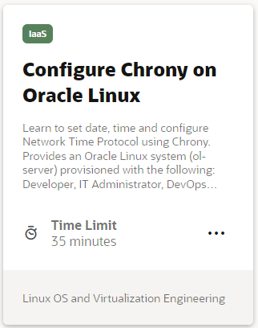](https://luna.oracle.com/lab/4946609e-41e4-4d26-8501-da948bb299ba)[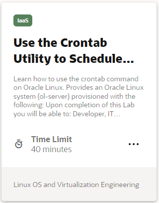](https://luna.oracle.com/lab/d857ff70-1799-472e-b413-32ea7e356470)[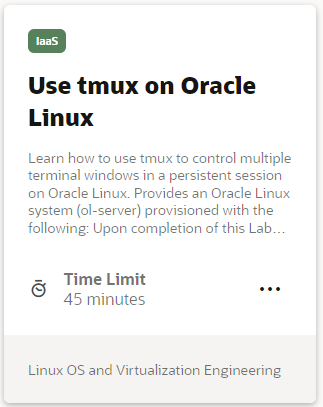](https://luna.oracle.com/lab/4dda7413-1a31-47bf-96c1-8fa6c306dc6b)[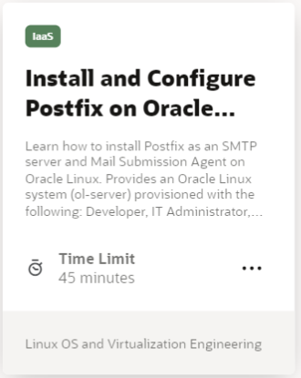](https://luna.oracle.com/lab/4255c51c-4f52-45f3-a3e8-125b8cf1b40b)[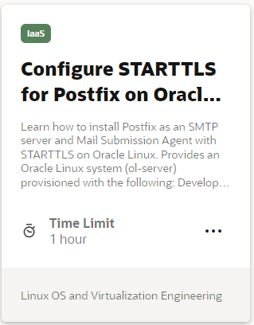](https://luna.oracle.com/lab/6c0d44b2-1247-4780-a1ae-09f283812ef8)[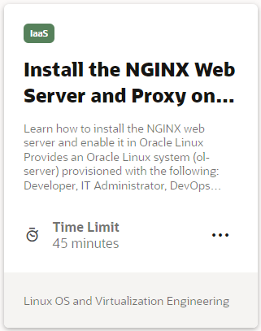](https://luna.oracle.com/lab/54fa9d88-4243-4b4f-bae2-d52ec8cfb688)[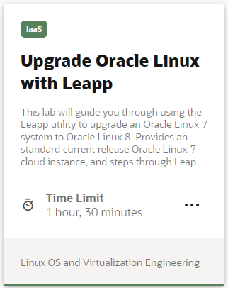](https://luna.oracle.com/lab/908d0e5b-4444-400a-87a7-2a9ec8c27550)[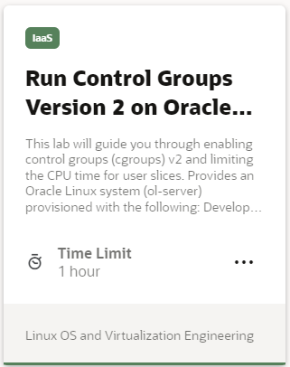](https://luna.oracle.com/lab/14d89b6d-627b-4f1f-b859-4761e3ed352c)[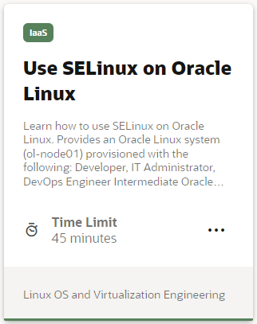](https://luna.oracle.com/lab/89a09fdd-47c2-4755-b98e-35863bdf7bc0)


Oracle Learning Library is the place to explore Oracle Linux using free videos and hands-on tutorials and labs. These materials will enhance your knowledge and experience using Oracle Linux on the Cloud and On-Premises. Our library of training material covers everything from how to install the highly performant and secure operating environment, to configuring virtualization, automation, and cloud native computing tools. Bring your own environment, or use an Oracle-provided free lab environment.


You can use the [editor on GitHub](https://github.com/craigmcb/craigmcb.github.io/edit/main/README.md) to maintain and preview the content for your website in Markdown files.

Whenever you commit to this repository, GitHub Pages will run [Jekyll](https://jekyllrb.com/) to rebuild the pages in your site, from the content in your Markdown files.

### Markdown

Markdown is a lightweight and easy-to-use syntax for styling your writing. It includes conventions for

```markdown
Syntax highlighted code block

# Header 1
## Header 2
### Header 3

- Bulleted
- List

1. Numbered
2. List

**Bold** and _Italic_ and `Code` text

[Link](url) and 
```

For more details see [Basic writing and formatting syntax](https://docs.github.com/en/github/writing-on-github/getting-started-with-writing-and-formatting-on-github/basic-writing-and-formatting-syntax).

### Jekyll Themes

Your Pages site will use the layout and styles from the Jekyll theme you have selected in your [repository settings](https://github.com/craigmcb/craigmcb.github.io/settings/pages). The name of this theme is saved in the Jekyll `_config.yml` configuration file.

### Support or Contact

Having trouble with Pages? Check out our [documentation](https://docs.github.com/categories/github-pages-basics/) or [contact support](https://support.github.com/contact) and we’ll help you sort it out.
