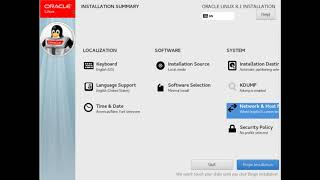
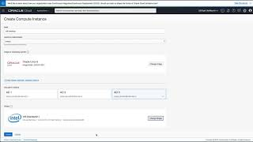
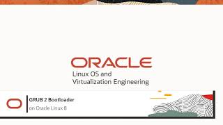
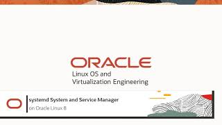

---
# Welcome to Oracle Linux Training
This site provides you information to help you grow your skillset using Oracle Linux. Whether you are working with traditional, cloud-based, or virtual environments, these skills will progress your knowledge into becoming a better Oracle Linux End-user, DevOps, or System Administrator.

On these pages, you will find videos, documents and other useful resources on topics such as:

- Installing the Operating System
- Technologies and components included in the Oracle Linux operating environment
- Building systems to suit your needs, whether development or production, physical or virtual
- Applying resources using fully-featured enterprise software

## Installation
One of the first skills to learn is how to install Oracle Linux. These videos go through this process step-by-step and complete a Linux installation.
### Videos

[Installing Oracle Linux 8](https://youtu.be/l6fapYCHaQ0)


[Install Oracle Linux on Oracle Cloud Infrastructure](https://youtu.be/ETpaOwAcB7M)


[BIOS Firmware Bootloader Process on Oracle Linux](https://youtu.be/NP9BHTjih7g)


[GRUB 2 on Oracle Linux](https://youtu.be/0dv87RFGcKI)


[Unified Extensible Firmware Interface on Oracle Linux](https://youtu.be/OVeso8h5HZA)


[systemd System and Service Manager on Oracle Linux](https://youtu.be/9uDvnZKhU8A)


[systemd Target Units on Oracle Linux](https://youtu.be/Tkxs-wfZrnw)

### Hands On Labs

Oracle Learning Library is the place to explore Oracle Linux using free videos and hands-on tutorials and labs. These materials will enhance your knowledge and experience using Oracle Linux on the Cloud and On-Premises. Our library of training material covers everything from how to install the highly performant and secure operating environment, to configuring virtualization, automation, and cloud native computing tools. Bring your own environment, or use an Oracle-provided free lab environment.


You can use the [editor on GitHub](https://github.com/craigmcb/craigmcb.github.io/edit/main/README.md) to maintain and preview the content for your website in Markdown files.

Whenever you commit to this repository, GitHub Pages will run [Jekyll](https://jekyllrb.com/) to rebuild the pages in your site, from the content in your Markdown files.

### Markdown

Markdown is a lightweight and easy-to-use syntax for styling your writing. It includes conventions for

```markdown
Syntax highlighted code block

# Header 1
## Header 2
### Header 3

- Bulleted
- List

1. Numbered
2. List

**Bold** and _Italic_ and `Code` text

[Link](url) and 
```

For more details see [Basic writing and formatting syntax](https://docs.github.com/en/github/writing-on-github/getting-started-with-writing-and-formatting-on-github/basic-writing-and-formatting-syntax).

### Jekyll Themes

Your Pages site will use the layout and styles from the Jekyll theme you have selected in your [repository settings](https://github.com/craigmcb/craigmcb.github.io/settings/pages). The name of this theme is saved in the Jekyll `_config.yml` configuration file.

### Support or Contact

Having trouble with Pages? Check out our [documentation](https://docs.github.com/categories/github-pages-basics/) or [contact support](https://support.github.com/contact) and we’ll help you sort it out.
