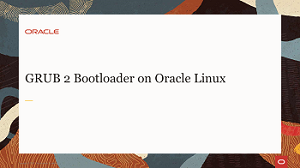
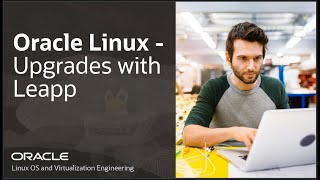

---
# Welcome to Oracle Linux Training
This site is the place to explore Oracle Linux to help you grow your skillset using free videos and hands-on tutorials and labs. Whether you are working with traditional, cloud-based, or virtual environments, these skills will progress your knowledge into becoming a better Oracle Linux End-user, DevOps, or System Administrator.

On these pages, you will find videos, documents and other useful resources on topics such as:

- Installing the Operating System
- Technologies and components included in the Oracle Linux operating environment
- Building systems to suit your needs, whether development or production, physical or virtual
- Applying resources using fully-featured enterprise software

## Installation
One of the first skills to learn is how to install Oracle Linux.

### Videos
These videos focus on the installation and boot process. You can learn step-by-step how to complete an Oracle Linux 8 installation for on-premises deployment and how to create an Oracle Linux 8 instance on Oracle Cloud Infrastructure. You can also learn about the boot process and how to configure different services to start at boot time.


[](https://youtu.be/l6fapYCHaQ0)[](https://youtu.be/ETpaOwAcB7M)[](https://youtu.be/NP9BHTjih7g)[](https://youtu.be/0dv87RFGcKI)[](https://youtu.be/OVeso8h5HZA)[](https://youtu.be/9uDvnZKhU8A)[](https://youtu.be/Tkxs-wfZrnw)

Installing Oracle Linux 8

[](https://youtu.be/ETpaOwAcB7M)
Install Oracle Linux 8 on Oracle Cloud Infrastructure

[](https://youtu.be/NP9BHTjih7g)
BIOS Firmware Bootloader Process on Oracle Linux

[](https://youtu.be/0dv87RFGcKI)
GRUB 2 on Oracle Linux

[](https://youtu.be/OVeso8h5HZA)
Unified Extensible Firmware Interface on Oracle Linux

[](https://youtu.be/9uDvnZKhU8A)
systemd System and Service Manager on Oracle Linux

[](https://youtu.be/Tkxs-wfZrnw)
systemd Target Units on Oracle Linux

### Hands On Labs
Each hands-on lab provides step-by-step procedures to complete specific tasks in an Oracle-provided free lab environment. Follow the procedures to connect to your Oracle Linux compute instance on Oracle Cloud Infrastructure and complete the labs. Alternatively, you can perform the lab steps on your own Oracle Linux environment.

[](https://luna.oracle.com/lab/67f106f2-8c50-442c-b24f-108b806be84f)[](https://luna.oracle.com/lab/d657ae3c-ac29-4b0a-943e-e533f2e8093b)[](https://luna.oracle.com/lab/aa8f2377-7967-4e45-bf32-bdc8054d5c76)[](https://luna.oracle.com/lab/8a060473-bff3-4c04-9799-eb944951007c)[](https://luna.oracle.com/lab/ee1c4ab9-010f-4b3c-bd1e-cdcca57800a2)

Manage the Boot Kernel for Oracle Linux

[](https://luna.oracle.com/lab/d657ae3c-ac29-4b0a-943e-e533f2e8093b)
Learn How to Localize Your Installation on Oracle Linux

[](https://luna.oracle.com/lab/aa8f2377-7967-4e45-bf32-bdc8054d5c76)
Configure System Settings on Oracle Linux

[](https://luna.oracle.com/lab/8a060473-bff3-4c04-9799-eb944951007c)
Use systemd on Oracle Linux

[](https://luna.oracle.com/lab/ee1c4ab9-010f-4b3c-bd1e-cdcca57800a2)
Switch from CentOS 8 to Oracle Linux 8

## Administration
Learn how to administer Oracle Linux. These tasks are applicable for on-premises systems or Oracle Cloud Infrastructure instances.

### Videos
These short videos go through some common administration tasks that you can perform on Oracle Linux. You can learn step-by-step how to configure the system date and time, automate tasks, dynamically load and unload kernel modules, configure users and groups, configure networking, and explore the proc and sysfs file systems to view and configure system hardware and system processes.

[](https://youtu.be/q8VlYiF5sx8)
System Configuration Date and Time

[](https://youtu.be/1F51ZHAVfAk)
System Configuration Proc File System

[](https://youtu.be/j9x2cuOE5_Y)
System Configuration Sysfs File System

[](https://youtu.be/BpPGoRYTv9I)
Oracle Linux Automating Tasks Cron Utility

[](https://youtu.be/EIV3lpTeqXo)
Oracle Linux Automating Tasks Anacron, At, and Batch Utilities

[](https://youtu.be/AeW42ZyzHrQ)
Oracle Linux Kernel Module Configuration

[](https://youtu.be/fag6aHNUkdQ)
Oracle Linux Users and Groups

[](https://youtu.be/WrcnDpj3axQ)
Oracle Linux Password Aging and Su

[](https://youtu.be/xpBBUPLEkZg)
Configure and Connect to an FTP Server on Oracle Linux

[](https://youtu.be/5xKldV3knzU)
Introduction to Using vim on Oracle Linux

[](https://youtu.be/pk6tgzGpAU4)
Oracle Linux Upgrades with Leapp

[](https://youtu.be/AiYK0VBW7e4)
Introduction to Control Groups on Oracle Linux

[](https://youtu.be/meKjLOxEu_o)
SELinux Basics on Oracle Linux


Oracle Learning Library is the place to explore Oracle Linux using free videos and hands-on tutorials and labs. These materials will enhance your knowledge and experience using Oracle Linux on the Cloud and On-Premises. Our library of training material covers everything from how to install the highly performant and secure operating environment, to configuring virtualization, automation, and cloud native computing tools. Bring your own environment, or use an Oracle-provided free lab environment.


You can use the [editor on GitHub](https://github.com/craigmcb/craigmcb.github.io/edit/main/README.md) to maintain and preview the content for your website in Markdown files.

Whenever you commit to this repository, GitHub Pages will run [Jekyll](https://jekyllrb.com/) to rebuild the pages in your site, from the content in your Markdown files.

### Markdown

Markdown is a lightweight and easy-to-use syntax for styling your writing. It includes conventions for

```markdown
Syntax highlighted code block

# Header 1
## Header 2
### Header 3

- Bulleted
- List

1. Numbered
2. List

**Bold** and _Italic_ and `Code` text

[Link](url) and 
```

For more details see [Basic writing and formatting syntax](https://docs.github.com/en/github/writing-on-github/getting-started-with-writing-and-formatting-on-github/basic-writing-and-formatting-syntax).

### Jekyll Themes

Your Pages site will use the layout and styles from the Jekyll theme you have selected in your [repository settings](https://github.com/craigmcb/craigmcb.github.io/settings/pages). The name of this theme is saved in the Jekyll `_config.yml` configuration file.

### Support or Contact

Having trouble with Pages? Check out our [documentation](https://docs.github.com/categories/github-pages-basics/) or [contact support](https://support.github.com/contact) and we’ll help you sort it out.
